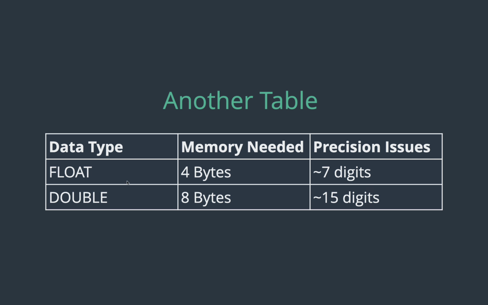

<!-- Data Types https://dev.mysql.com/doc/refman/8.4/en/data-types.html -->
1. numberic types
- INT (e.g. 18 , -1999 , 0)

2. string types
- varchar (e.g. 'coo=ffe', '-1333' )

3. date types

#### CHAR vs. VARCHAR
char 存取資料 -> 有固定長度
varchar 存取資料 -> 沒有固定長度


#### Number Type
spec: https://dev.mysql.com/doc/refman/8.4/en/integer-types.html

unsigned means no negative

#### Decimal （more exact, take more space）--> 更精確
- （up to total number of digits,up to digits after decimal）
```SQL
Decimal(5,2)
```


#### float & double (stoer more larger decimal using less space, but it comes at the **cost of precision** )

```SQL
-- persume x is float
-- persume y is double
INSERT INTO nums(x,y) VALUES (1.12345678, 1.908789789789)
-- x 1.123456 (7 digits)
-- y 1.12345678 (15 digits)

INSERT INTO nums(x,y) VALUES (1.12345678, 1.9087897897898789789678678)
-- x 1.123456 (7 digits)
-- y 1.12345678 (15 digits)
```

#### DATE Type （DATE, TIME, DATETIME）
spec: https://dev.mysql.com/doc/refman/8.4/en/date-and-time-functions.html
```SQL
CREATE TABLE people (
	name VARCHAR(100),
    birthdate DATE,
    birthtime TIME,
    birthdt DATETIME
);

INSERT INTO people (name, birthdate, birthtime, birthdt)
VALUES ('Juan', '2020-08-15', '23:59:00', '2020-08-15 23:59:00');
```

#### Current time , date
```SQL
SELECT CURTIME();
 
SELECT CURDATE();
 
SELECT NOW();
 
INSERT INTO people (name, birthdate, birthtime, birthdt)
VALUES ('Hazel', CURDATE(), CURTIME(), NOW());
```

```SQL
SELECT 
  birthdate,
  DAY(birthdate),
  DAYOFWEEK(birthdate),
  DAYOFYEAR(birthdate)
FROM people;
 
SELECT 
  birthdate,
  MONTHNAME(birthdate),
  YEAR(birthdate)
FROM people;
```

### Time 
```SQL
SELECT 
   birthtime,
   HOUR(birthtime),
   MINUTE(birthtime)
FROM people;
 
SELECT 
   birthdt,
   MONTH(birthdt),
   DAY(birthdt),
   HOUR(birthdt),
   MINUTE(birthdt)
FROM people;
```

### Format Date
https://dev.mysql.com/doc/refman/8.4/en/date-and-time-functions.html
```SQL
SELECT birthdate, DATE_FORMAT(birthdate, '%a %b %D') FROM people;
 
SELECT birthdt, DATE_FORMAT(birthdt, '%H:%i') FROM people;
 
SELECT birthdt, DATE_FORMAT(birthdt, 'BORN ON: %r') FROM people;
```